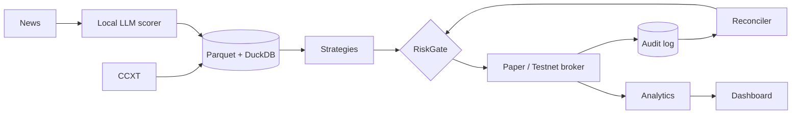

# CryptoLab

Crypto quant research, backtesting, and paper-trading platform. The goal is honest results: costs
included, no look-ahead, out-of-sample, always compared against buy-and-hold BTC.

**Safe by default:** the only execution modes are `backtest`, `paper`, and `testnet`. A live path does
not exist until the Phase 2 gates in `docs/sdd/deployment.md` pass and Ethan signs off.



## Quick start

```bash
uv sync --all-extras
# 1. download hourly candles (public data, no API key)
uv run cryptolab data download BTC/USDT ETH/USDT SOL/USDT BNB/USDT XRP/USDT --start 2023-01-01
# 2. run a backtest from a config; prints the report vs BTC buy & hold
uv run cryptolab backtest configs/backtests/ma_crossover_btc.yaml
# reports/<timestamp>-<name>/ gets report.md, report.json, equity.csv, fills.csv, rejections.csv
```

Other commands: `cryptolab strategies`, `cryptolab data list`, `cryptolab data quality BTC/USDT`,
`cryptolab status`. Write your own run by copying a file in `configs/backtests/`; a new strategy is
one new file in `cryptolab/strategies/` (it's discovered automatically).

## Setup

```bash
uv sync --all-extras
cp .env.example .env        # fill testnet keys only if using testnet mode
uv run pre-commit install
uv run pytest
uv run cryptolab status
```

Docs: `docs/sdd/` (architecture, math, risk model, deployment, decision log) · Conventions: `CLAUDE.md`.
