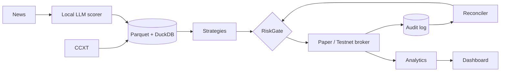

# CryptoLab

Crypto quant research, backtesting, and paper-trading platform. The goal is honest results: costs
included, no look-ahead, out-of-sample, always compared against buy-and-hold BTC.

**Safe by default:** the only execution modes are `backtest`, `paper`, and `testnet`. A live path does
not exist until the Phase 2 gates in `docs/sdd/deployment.md` pass and Ethan signs off.



## Setup

```bash
uv sync --all-extras
cp .env.example .env        # fill testnet keys only if using testnet mode
uv run pre-commit install
uv run pytest
uv run cryptolab status
```

Docs: `docs/sdd/` (architecture, math, risk model, deployment, decision log) · Conventions: `CLAUDE.md`.
