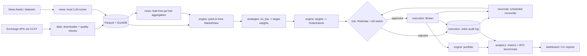

# Architecture

Status: **Draft v0.1** (2026-09-26). Reconciled with `docs/context/CRYPTOLAB_CONTEXT.md` and the planning doc/SRS. Changes are logged in `decision-log.md`.

## 1. Purpose and scope

CryptoLab pulls crypto market data and news, turns them into trading signals, tests those signals honestly on history (after costs, no look-ahead, out of sample, against buy-and-hold BTC), and runs them forward in **paper or testnet** mode.

Real capital is a *future*, gated extension. See `deployment.md` §Phase 2.

- **In scope (v1):**
  - spot crypto, hourly (primary) and daily candles (D-007)
  - long-only strategies, plus long/short in simulation only (D-011)
  - the LLM news-sentiment signal
  - backtesting, reporting, paper trading, and testnet trading
- **Out of scope (v1):**
  - live-capital execution (until Phase 2 sign-off)
  - derivatives, order-book/tick data, HFT
  - multi-user accounts

## 2. Data flow

The system is one-directional, as in the SRS. The safety chain is new: strategies never talk to a broker directly.



### The three run modes share one pipeline

| Mode | Clock | Broker | Reconciled against |
|---|---|---|---|
| `backtest` | historical bars, replayed in order | `SimBroker` (fill model in `math.md` §5) | audit-log replay |
| `paper` | live bar closes | `PaperBroker` (same fill model as `SimBroker`) | audit-log replay of its own ledger |
| `testnet` | live bar closes | `TestnetBroker` (CCXT with `set_sandbox_mode(True)`) | exchange testnet balances, orders, and trades |

In all three modes, strategy code, sizing, RiskGate, and the audit log are **the same code**. That's what makes a paper track record evidence about how the system will behave live.

**There is no live broker.** `TradingMode` has no live member, and CI enforces it (`tests/test_safety_guards.py`).

## 3. Module boundaries

The code is laid out as the flat package `cryptolab/`. Import-linter contracts in `pyproject.toml` enforce the "must not import" column of the CLAUDE.md module map.

| Module | Owns | Public interface (planned) | FR/NFR |
|---|---|---|---|
| `config/` | Settings (env), YAML configs (Pydantic), frozen `RiskLimits` | `Settings`, `TradingMode`, `load_backtest_config()`, `load_risk_limits()` | NFR-06 |
| `data/` | CCXT OHLCV download, incremental updates, gap/dupe/bad-value checks, store | `download(...)`, `update(...)`, `quality_report(...)`, `OhlcvStore.read(symbol, tf, start, end)` | FR-01..04 |
| `news/` | headline ingest (source, url, `published_at` UTC, `first_seen_at`), LLM scoring with model and prompt version, aggregation | `score_headlines(...)`, `sentiment_series(coin, tf, ...)` | FR-05..08 |
| `strategies/` | one file per strategy | `Strategy` protocol: `on_bar(view: MarketView) -> dict[str, float]` (target weights) | FR-09..12, NFR-04 |
| `engine/` | event loop, `MarketView` (point in time), sizing, `SimBroker` fill model, portfolio accounting | `run_backtest(config) -> BacktestResult` | FR-13..16, NFR-01..03 |
| `risk/` | `RiskLimits` enforcement, kill switch with persisted state | `RiskGate.check(intent, portfolio) -> Verdict`, `KillSwitch` | FR-24..26 (new) |
| `execution/` | `Broker` protocol, `PaperBroker`, `TestnetBroker`, `AuditLog` | `Broker.submit(order)`, `AuditLog.append(record)`, `replay()` | FR-27 (new) |
| `reconcile/` | reconciliation job and report | `reconcile(broker, audit_log) -> ReconReport` | FR-28 (new) |
| `analytics/` | metrics, benchmark, walk-forward, sensitivity | `metrics(equity, trades) -> MetricsReport` | FR-17..20 |
| `dashboard/` | Streamlit app. View-models shaped for the CryptoLab App v2 port (D-006). | `build_*_view(...)` | FR-22 |
| `cli.py` | Typer CLI | `cryptolab backtest|paper|data|risk ...` | FR-21, FR-23 |

### Key interfaces (contract sketch; final signatures land with each module)

```python
class MarketView(Protocol):  # engine; point-in-time, read-only
    now: datetime  # decision time = close of the current bar

    def bars(self, symbol: str, lookback: int) -> pd.DataFrame: ...  # only bars with close <= now
    def sentiment(self, coin: str) -> SentimentPoint | None: ...  # math.md §7 window only


class Strategy(Protocol):  # strategies
    name: str

    def on_bar(self, view: MarketView) -> dict[str, float]: ...  # symbol -> target weight


@dataclass(frozen=True)
class OrderIntent:  # engine -> risk
    strategy: str
    symbol: str
    side: Side
    qty: float
    ref_price: float
    decision_ts: datetime
    bar_ts: datetime
    signal_inputs: Mapping[str, Any]


class Broker(Protocol):  # execution
    def submit(self, order: ApprovedOrder) -> Fill | Rejection: ...
    def balances(self) -> Mapping[str, float]: ...
    def open_orders(self) -> list[OpenOrder]: ...
```

A strategy returns **target weights**. It never gets a handle on the broker, the portfolio object, the risk limits, or the clock.

This is the single most important boundary, for two reasons:
- It blocks look-ahead, because `MarketView` only exposes data with close ≤ `now`.
- It blocks limit overrides, because limits live in `risk/` and are loaded by the runner.

## 4. Storage layout

```
data/                         # git-ignored
  ohlcv/{exchange}/{timeframe}/{symbol}/year=YYYY/part.parquet
  news/raw/{source}/date=YYYY-MM-DD/part.parquet
  news/scores/model={model}/prompt={version}/part.parquet
  cryptolab.duckdb            # views over the Parquet; no server
state/                        # git-ignored; runtime state for paper/testnet
  risk_state.sqlite           # kill switch, daily-loss anchors
  audit/orders.sqlite         # append-only order audit log (+ JSONL mirror)
  recon/                      # reconciliation reports
```

- Parquet is the source of truth for market and news data. DuckDB is a query layer and can be rebuilt from the Parquet.
- Runtime safety state lives in SQLite: one file, transactional, standard library, no server. See D-005.

## 5. Tech stack

The stack is taken from the context doc (D-002):
- Python ≥3.11 (dev machine currently 3.12), managed with `uv`
- pandas + NumPy, CCXT, Parquet (pyarrow) + DuckDB
- a local LLM via an OpenAI-compatible server
- SciPy/statsmodels
- YAML + Pydantic (`pydantic-settings` for env)
- Typer CLI, Streamlit dashboard
- pytest + hypothesis + coverage, ruff, mypy, import-linter
- pre-commit (gitleaks, detect-secrets, conventional commits), GitHub Actions

## 6. UI

- **Phase 1:** a Streamlit dashboard (FR-22). It shows:
  - equity vs BTC buy-and-hold
  - drawdown
  - the trade log
  - the metrics table
  - the paper/testnet state: mode, kill-switch state, last reconciliation, the order audit log
- **Later:** a port of the Claude Design prototype "CryptoLab App v2" (P4).
  - Source files are imported read-only into `ui-reference/` once the design MCP is connected.
  - The data contract `api.js`/`data.js` expect will be documented here, and `dashboard/` view-models will match it, so the port becomes a thin FastAPI layer (D-006).
  - **TODO:** document the contract once the files are imported.

## 7. Requirement traceability additions

These safety requirements are new and extend the SRS; the existing IDs stay unchanged:

| ID | Requirement |
|---|---|
| FR-24 | Hard position limits are enforced by RiskGate from config. Strategies cannot alter them. |
| FR-25 | A kill switch halts new orders when daily loss or drawdown limits are breached. Its state persists across restarts, and only a manual, logged reset clears it. |
| FR-26 | Default mode is paper. A live path exists only after a LIVE-SIGNOFF (deployment.md). |
| FR-27 | Every order intent (approved or rejected) and every fill is written to an append-only audit log, with enough detail to reconstruct it. |
| FR-28 | Local and broker state are reconciled on a schedule. A mismatch trips the kill switch and alerts. |
| NFR-07 | Fail closed: if risk state or the audit log can't be read or written, no order is sent. |
| NFR-08 | Secrets: env/secrets manager only, and scanned for in pre-commit and CI. |
